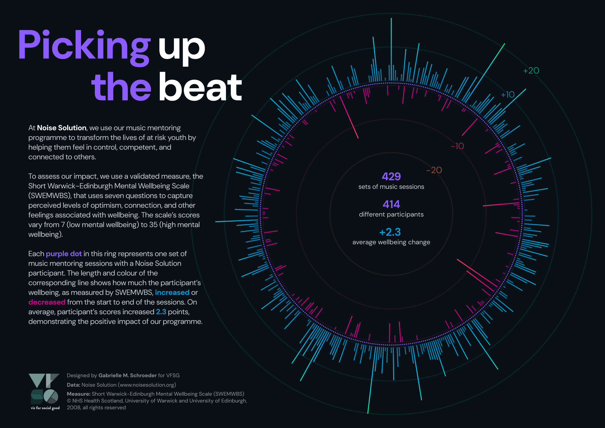

# Viz For Social Good: Noise Solution

Despite being short on time this month, I couldn't resist participating in [VFSG's project with Noise Solution](https://www.vizforsocialgood.com/join-a-project/2024/7/26/noisesolution), a charity based in England that uses music mentoring programmes to transform the lives of at risk youth.

For my submission, I focused on visualising how participants' wellbeing changed from the start to the end of the programme:

## Design choices

For this project, I was inspired by the music theme to visualise the data in the shape of an old-school music player ring. Each point and line maps onto a set of Noise Solution sessions (and the corresponding participant), which helps emphasise the impact of the programme on individual people.

Noise Solution's branding also played a large role in my design. In addition to some of Noise Solution's brand colours (purple, near-black, light grey, and white), I took inspiration from the photographs on their [website](https://www.noisesolution.org/), many of which have bright blues, teals, pinks, and oranges from coloured lights. Since I don't have a license for Noise Solution's brand font, [Roc Grotesk](https://fonts.adobe.com/fonts/roc-grotesk), I used a similar font with an Open Font License, [DM Sans](https://fonts.google.com/specimen/DM+Sans).

The title references a music concept - matching a beat or rhythm - that also emphasises Noise Solution's mission: by choosing to focus on mental wellbeing, they help their participants become more optimistic (or upbeat). 

## Possible next steps

One of Noise Solution's requests that I didn't have time to fulfill was to make the visualisation interactive. There are some options for this approach in R (e.g., {plotly} and {shiny}), and I'm also keen to learn Javascript so that I can develop interactive visualisations for the web.

While my chart choice emphasises the wellbeing change of each individual, it doesn't accurately show the distribution of changes across all participants. As such, this visualisation would be complemented by an additional chart type that shows the distribution of wellbeing changes.

## Tools

I created this visualisation using R (the R output is in the plots folder) and used Figma for the text and final layout.

## License

The code for this project is licensed under the [MIT License](https://opensource.org/license/mit). The visualisations and write-up are licensed under [CC-BY-NC](https://creativecommons.org/licenses/by-nc/4.0/).

